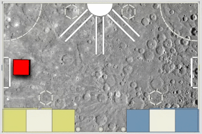

Currently simulator is very basic, it has just a few features. In the future
we should find more user friendly way to use simulator and to implement more features.



## How to use simulator?
To start simulator you have to run **./simulator** from the root directory
```
./simulator
```

Alternative command (for windows environment):
```
npm run-script simulator
```

It will start WebSocket server & open simulator in your default web browser.

Now our simulator is ready and waiting for commands. To use MEP (our brain application)
to control robot in simulator just run **./mep** with simulation flag (-s):
```
./mep -s
```

Alternative command (for windows environment):
```
npm run-script test_simulation
```


Robot should move on the screen.